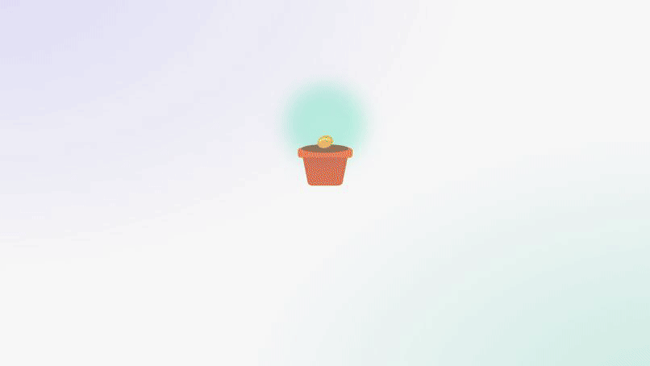
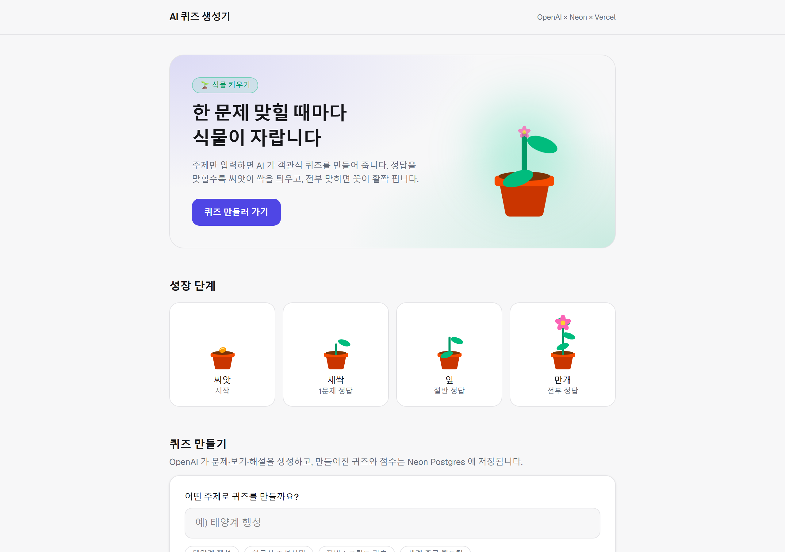
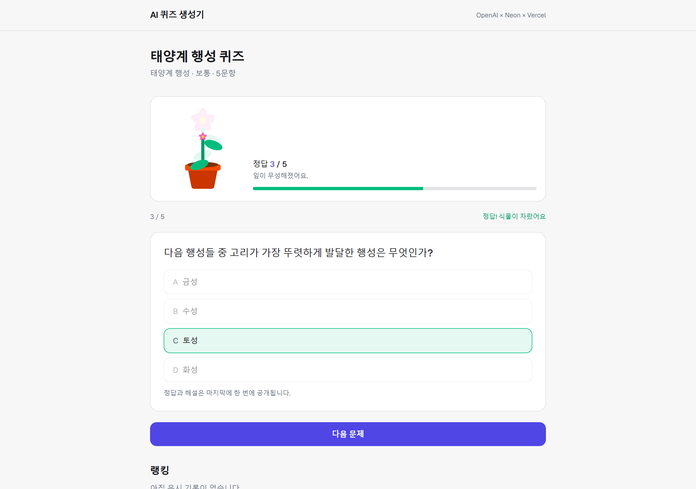
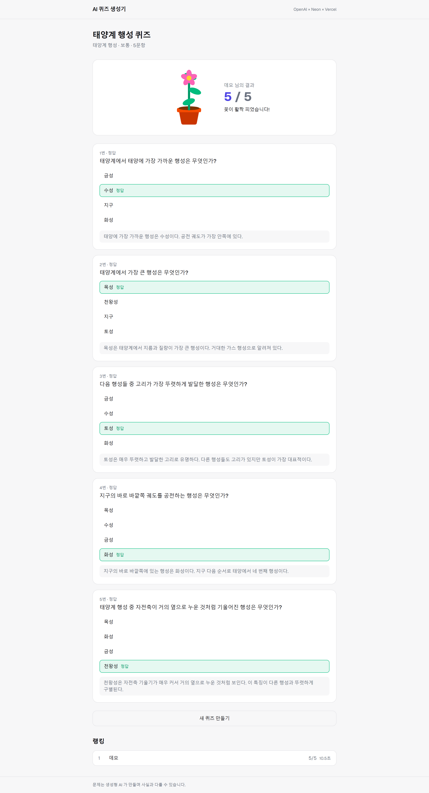
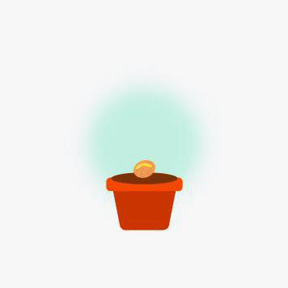

# AI 퀴즈 생성기

주제만 입력하면 AI 가 객관식 문제·보기·해설을 만들어 주는 웹 앱.
한 문제 맞힐 때마다 화면 위의 식물이 자라고, 전부 맞히면 꽃이 활짝 핀다.

**배포 주소 →** https://ai-quiz-eight-umber.vercel.app



> 위 GIF 는 화질을 낮춘 것이다. 원본은 **[intro.mp4](docs/intro.mp4)** (1920×1080 · 30fps · 53초 · 무음).
> Remotion 으로 만들었고 소스는 [`video/`](video) 에 있다.

---



---

## 어떻게 동작하나

| | |
| --- | --- |
| **문제 생성** | `@ai-sdk/openai` 를 통한 런타임 LLM 호출. 하드코딩된 문제 은행은 없다. |
| **저장** | 생성된 퀴즈와 응시 기록은 Neon Postgres 에 남는다. |
| **공유** | 퀴즈마다 URL(`/quiz/[id]`)이 생겨 같은 문제를 다시 만들지 않고 공유·재사용한다. |
| **채점** | 전부 서버에서. 정답과 해설은 클라이언트로 미리 내려보내지 않는다. |

### 1. 주제를 고르고 난이도·문항 수를 정한다

난이도 3단계(쉬움/보통/어려움), 문항 수 3~12개. 생성에는 보통 10~30초 걸린다.

### 2. 한 문제씩 풀면 식물이 자란다



보기를 고르면 즉시 정답 여부만 알려주고 보기가 잠긴다.
맞히면 식물이 한 단계 자라고, 틀리면 고른 보기가 흔들린다.
**정답과 해설은 끝까지 공개하지 않는다.**

### 3. 마지막에 해설과 랭킹을 한 번에 본다



---

## 빠른 시작

```bash
git clone https://github.com/moonshinehjh3-maker/quiz-app.git
cd quiz-app
npm install
cp .env.local.example .env.local   # 아래 환경 변수를 채운다
npm run dev                        # http://localhost:3000
```

스키마는 따로 마이그레이션할 필요가 없다. `lib/db.ts` 의 `ensureSchema()` 가
첫 쿼리 때 `quizzes`, `questions`, `attempts` 테이블을 자동 생성한다.

### 환경 변수

| 변수 | 필수 | 설명 |
| --- | --- | --- |
| `DATABASE_URL` | ✅ | Neon Postgres 연결 문자열 (pooled) |
| `OPENAI_API_KEY` | ✅ | OpenAI API 키 |
| `OPENAI_MODEL` | | 기본값 `gpt-5.4-mini` |

**Neon** 은 Vercel Marketplace 통합으로 프로비저닝하면 `DATABASE_URL` 이
프로젝트에 자동 주입된다. 직접 만들려면 [neon.com](https://neon.com) 에서
프로젝트를 만들고 연결 문자열을 복사하면 된다.

Vercel 에 이미 연결된 프로젝트라면 값을 직접 채우는 대신 아래로 내려받는다.

```bash
vercel link --project ai-quiz
vercel env pull .env.local
```

> `.env.local` 은 `.gitignore` 에 포함되어 있다. 절대 커밋하지 않는다.
> Vercel 의 `OPENAI_API_KEY` 는 Secret 타입이라 콘솔에서 값을 다시 읽을 수 없다.

### 배포

```bash
vercel deploy --prod
```

---

## 앱처럼 설치하기

PWA 라서 브라우저 탭이 아니라 독립 창으로 띄울 수 있다.

1. **정식 설치** — 사이트를 브라우저로 열고 주소창 오른쪽 **설치** 아이콘(⊕) 클릭.
   시작 메뉴·작업 표시줄에 등록되고 `manifest.webmanifest` 의 아이콘/테마가 적용된다.
2. **바탕화면 바로가기** — Edge 를 `--app=` 모드로 띄우면 주소창·탭 없이 앱 창으로 열린다.
   (아이콘: `%LOCALAPPDATA%\ai-quiz\quiz-icon.ico`)

macOS 의 `.app` 번들은 Windows 에서 만들 수 없어 PWA 설치로 대체했다.
진짜 단일 실행 파일(`.exe`)이 필요하면 Tauri/Electron 래핑이 필요하다.

---

## 식물 성장 규칙



성장률 = 맞힌 개수 / 전체 문항 수.

| 성장률 | 모습 |
| --- | --- |
| 0 | 흙 속 씨앗 |
| 0 초과 | 줄기가 솟음 |
| 0.15 / 0.4 / 0.64 | 잎이 하나씩 추가 (`LEAVES` 의 `at`) |
| 0.55 ~ 1.0 | 꽃이 서서히 피어남 (`BLOOM_FROM`) |
| 1.0 | 만개 |

위 수치는 `components/plant.tsx` 의 상수와 일치한다.
화면에 뜨는 문구(`싹이 텄어요` / `잎이 무성해졌어요` / `꽃봉오리가 맺혔어요`)는
별개의 기준(0 / 0.4 / 0.7)을 쓴다 — `quiz-player.tsx` 의 `growthMessage()`.

홈 화면에서도 이 요소를 전면에 보여준다.

- **히어로** — 씨앗에서 만개까지 반복 재생되는 식물 (`app/hero-plant.tsx`).
  `prefers-reduced-motion` 을 켠 사용자에게는 애니메이션 없이 만개 상태로 보여준다.
- **성장 단계** — 씨앗 / 새싹 / 잎 / 만개 4단계를 나란히 배치.
- **최근 퀴즈 카드** — 그 퀴즈의 최고 점수만큼 자란 식물을 함께 표시 (`best_score`).
- **풀이 화면** — 다 자란 모습을 10% 불투명도로 겹쳐 남은 성장 여지를 보여준다.

정답을 맞히면 `plant-pop` 애니메이션으로 튀어오르고, 틀리면 고른 보기가 `answer-shake` 로 흔들린다.

---

## 구조

| 경로 | 역할 |
| --- | --- |
| `lib/db.ts` | Neon 연결(지연 초기화) + 스키마 보장 |
| `lib/quiz.ts` | OpenAI 문제 생성, 저장, 채점, 랭킹 조회 |
| `lib/constants.ts` | 클라이언트와 공유하는 상수 |
| `app/api/quizzes` | POST — 생성 후 Neon 저장, id 반환 |
| `app/api/quizzes/[id]/check` | POST — 문항 1개 즉시 채점. **정답/오답 boolean 만** 반환 |
| `app/api/quizzes/[id]/attempts` | POST — **서버에서 최종 채점**, 결과+해설 반환 |
| `app/quiz/[id]` | 퀴즈 풀이 화면 + 랭킹 |
| `components/plant.tsx` | 정답 수에 따라 자라는 식물 SVG (홈·풀이 화면 공용) |
| `app/hero-plant.tsx` | 홈 히어로의 성장 애니메이션 |
| `app/manifest.ts` | PWA 매니페스트 (설치용 이름·아이콘·테마) |
| `app/pwa-register.tsx` | 서비스 워커 등록 |
| `public/sw.js` | 최소 서비스 워커 — 응답을 캐시하지 않고 오프라인 안내만 제공 |

**기술 스택** — Next.js 16 (App Router, Turbopack) · React 19 · Tailwind CSS v4 ·
AI SDK v7 (`@ai-sdk/openai`) · `@neondatabase/serverless` · Zod · Vercel

---

## 설계 메모

- 정답과 해설은 플레이 화면으로 내려보내지 않는다. 채점은 서버에서만 수행한다.
- 식물을 즉시 자라게 하려면 문항별 채점이 필요한데, `check` 는 `{ correct: boolean }` 만 돌려준다.
  정답 인덱스와 해설은 여전히 최종 결과 화면에서만 공개된다.
- 보기를 한 번 고르면 잠긴다. 즉시 피드백을 받은 뒤 답을 바꾸는 것을 막기 위해서다.
- LLM 이 정답을 첫 번째 보기에 몰아넣는 편향을 막기 위해 서버에서 보기 순서를 섞는다.
- 생성된 퀴즈는 DB 에 남아 URL 로 공유·재사용된다. 같은 퀴즈를 다시 LLM 으로 만들지 않는다.

> 문제는 생성형 AI 가 만들기 때문에 사실과 다를 수 있다.
